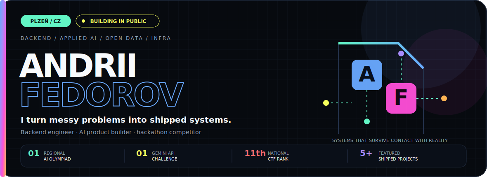
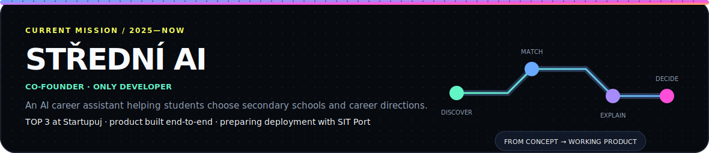
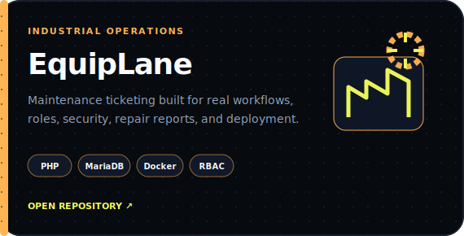
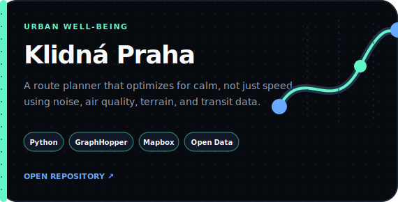
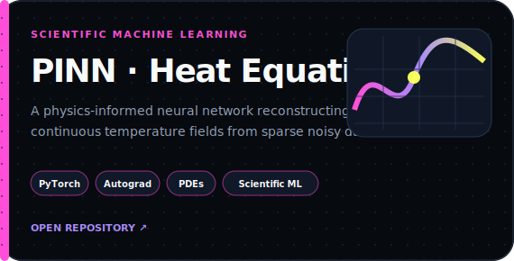
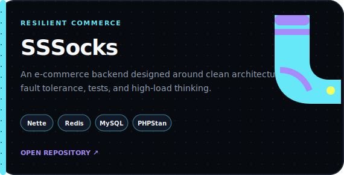
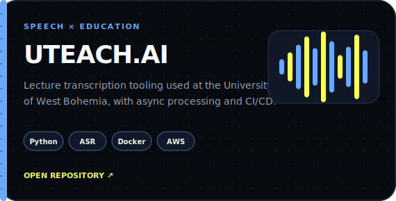
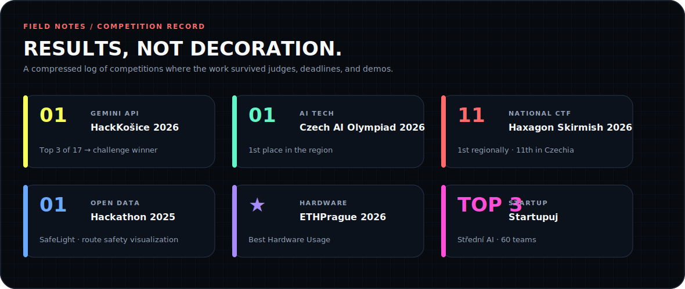
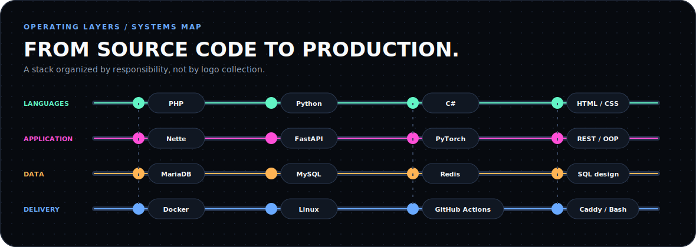
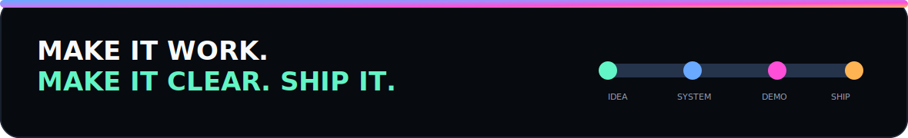

<p align="center">
  
</p>

<p align="center">
  <a href="mailto:qwertal0920@gmail.com"><strong>EMAIL</strong></a>
  &nbsp;&nbsp;·&nbsp;&nbsp;
  <a href="https://www.linkedin.com/in/andrii-fedorov-03b234392/"><strong>LINKEDIN</strong></a>
  &nbsp;&nbsp;·&nbsp;&nbsp;
  <a href="https://github.com/qqxzew?tab=repositories"><strong>REPOSITORIES</strong></a>
</p>

<br />

## `00 / WHO I AM`

I am an IT student in **Plzeň, Czech Republic**, graduating in **2028**. I build backend systems, applied-AI products, data tools, and infrastructure that can leave the demo laptop and operate in the real world.

My favorite work sits where **software engineering meets a concrete problem**: industrial maintenance, school choice, urban stress, scientific modeling, lecture accessibility, or resilient commerce.

<p align="center">
  
</p>

<br />

## `01 / SHIPPED SYSTEMS`

<p align="center">
  <a href="https://github.com/qqxzew/equiplane"></a>
  <a href="https://github.com/qqxzew/KlidnaPraha"></a>
</p>

<p align="center">
  <a href="https://github.com/qqxzew/pinn-heat-equation"></a>
  <a href="https://github.com/qqxzew/SSSocks"></a>
</p>

<p align="center">
  <a href="https://github.com/honzas83/uteach"></a>
</p>

<details>
<summary><strong>Project notes / readable version</strong></summary>
<br />

**EquipLane** — Industrial maintenance ticketing for failures, assignments, repair reports, service costs, role-based access, security, CI, and production deployment.  
`PHP 8.2` `MariaDB` `PDO` `Docker` `Caddy` `GitHub Actions`

**Klidná Praha** — A comfort-focused route planner combining noise, air quality, terrain, green zones, and public transport data to recommend calmer routes.  
`Python` `Node.js` `GraphHopper` `GeoJSON` `Mapbox` `Open Data`

**PINN for the 1D Heat Equation** — A physics-informed neural network reconstructing a continuous temperature field from sparse and noisy measurements while respecting the heat equation.  
`Python` `PyTorch` `Autograd` `Scientific ML` `PDEs`

**SSSocks** — An e-commerce backend designed around fault tolerance, tests, static analysis, and high-load architecture.  
`PHP` `Nette` `Redis` `MySQL` `PHPUnit` `PHPStan`

**UTEACH.AI** — Lecture and audio transcription tooling developed for the Faculty of Applied Sciences at the University of West Bohemia, with asynchronous processing, testing, Docker, and CI/CD.  
`Python` `Flask` `ASR` `Docker` `GitHub Actions` `AWS` `Terraform`

</details>

<br />

## `02 / COMPETITION RECORD`

<p align="center">
  
</p>

<br />

## `03 / HOW I BUILD`

<p align="center">
  
</p>

<br />

## `04 / OPERATING PRINCIPLES`

```text
01  Understand the real constraint before choosing the technology.
02  Design the data model and failure paths early.
03  Keep security and deployment inside the product, not after it.
04  Build a working vertical slice, then sharpen it with evidence.
05  Demo clearly. Document honestly. Ship.
```

<br />

<p align="center">
  
</p>

<p align="center">
  <a href="mailto:qwertal0920@gmail.com"><strong>qwertal0920@gmail.com</strong></a>
  &nbsp;&nbsp;·&nbsp;&nbsp;
  <a href="https://www.linkedin.com/in/andrii-fedorov-03b234392/"><strong>LinkedIn</strong></a>
  &nbsp;&nbsp;·&nbsp;&nbsp;
  <a href="https://github.com/qqxzew"><strong>@qqxzew</strong></a>
</p>
