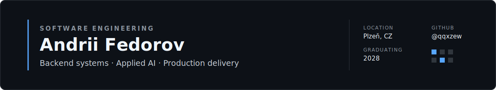

<picture>
  
</picture>

  <a href="https://www.linkedin.com/in/andrii-fedorov-03b234392/">LinkedIn</a>
  &nbsp;·&nbsp;
  <a href="mailto:qwertal0920@gmail.com">Email</a>
  &nbsp;·&nbsp;
  <a href="https://github.com/qqxzew?tab=repositories">Repositories</a>

> Co-founder and sole developer of **Střední AI** · IT student graduating in 2028 · Interested in backend engineering, applied AI, and practical products

## About

I am an IT student based in Plzeň, focused on backend development, applied AI, databases, and production deployment.

I enjoy building practical software for real problems — from industrial maintenance and education to urban mobility and scientific computing. I care about taking projects beyond prototypes: clear architecture, testing, deployment, and real-world use.

| Backend engineering | Applied AI | Production |
| --- | --- | --- |
| PHP, Python, REST APIs | PyTorch, FastAPI, data processing | Docker, Linux, CI/CD |
| Database design, SQL, OOP | Scientific ML, automation | Caddy, GitHub Actions |

---

## Selected projects

### [EquipLane](https://github.com/qqxzew/equiplane)
Industrial maintenance ticketing system with role-based access control, repair reporting, service-cost tracking, CSRF protection, and production deployment.

`PHP` `MariaDB` `PDO` `Docker` `Caddy` `GitHub Actions`

### [Klidná Praha](https://github.com/qqxzew/KlidnaPraha)
Route-planning application that recommends calmer routes through Prague using public transport, noise, air-quality, terrain, and green-space data.

`Python` `Node.js` `GraphHopper` `GeoJSON` `Mapbox`

### [PINN for the 1D Heat Equation](https://github.com/qqxzew/pinn-heat-equation)
Physics-informed neural network for reconstructing a continuous temperature field from sparse and noisy measurements.

`Python` `PyTorch` `Autograd` `Scientific ML`

### [SSSocks](https://github.com/qqxzew/SSSocks)
E-commerce backend designed with testing, static analysis, caching, and fault tolerance in mind.

`PHP` `Nette` `Redis` `MySQL` `PHPUnit` `PHPStan`

### [UTEACH.AI](https://github.com/honzas83/uteach)
Lecture transcription platform developed for the Faculty of Applied Sciences at the University of West Bohemia.

`Python` `Flask` `Docker` `GitHub Actions` `AWS` `Terraform`

---

## Selected achievements

| Year | Result |
| --- | --- |
| **2026** | **HackKošice** — 1st place in the MLH Gemini API Challenge; Top 3 among 17 teams in the challenge |
| **2026** | **Czech AI Olympiad** — 1st place in the regional AI Tech category |
| **2026** | **Haxagon Skirmish CTF** — 1st place regionally, 11th in the Czech Republic |
| **2026** | **ETHPrague** — Best Hardware Usage |
| **2025** | **Open Data Hackathon** — 1st place with SafeLight |
| — | **Startupuj** — Top 3 out of 60 teams with Střední AI |

---

## Technologies

**Languages**  
`PHP` `Python` `C#` `HTML` `CSS`

**Frameworks and libraries**  
`Nette` `FastAPI` `PyTorch`

**Data and infrastructure**  
`MariaDB` `MySQL` `Redis` `Docker` `Linux` `Bash` `GitHub Actions` `Composer` `Caddy`

**Engineering**  
`REST APIs` `OOP` `Database design` `SQL` `Applied machine learning`

---

## Contact

For collaboration, hackathons, or internship opportunities:

[LinkedIn](https://www.linkedin.com/in/andrii-fedorov-03b234392/) · [qwertal0920@gmail.com](mailto:qwertal0920@gmail.com)
